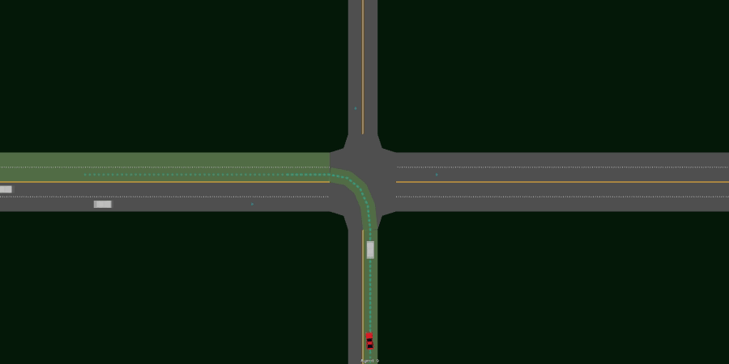
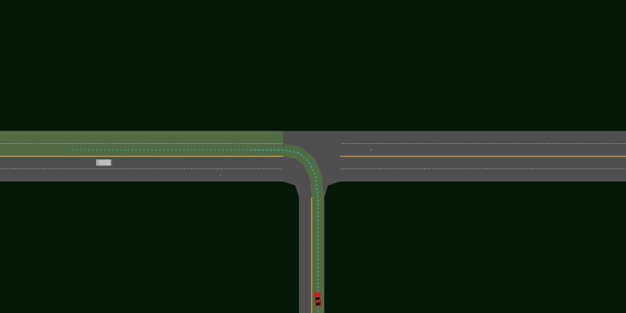
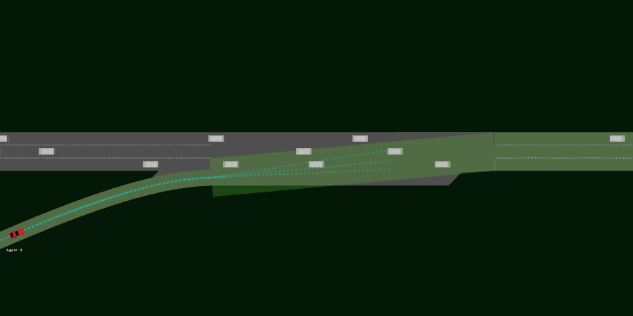
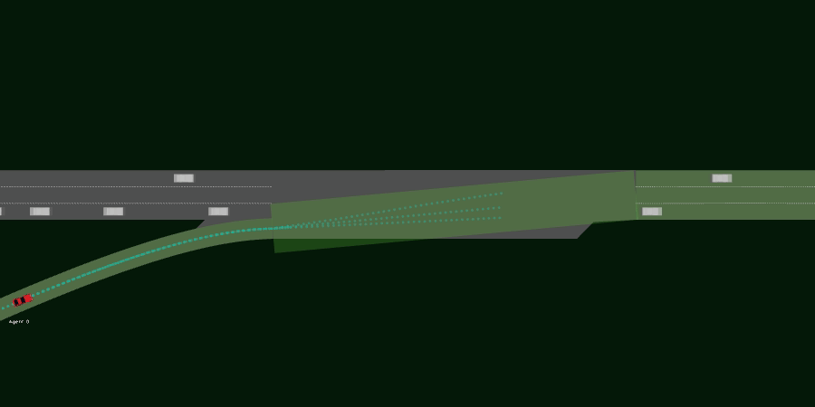
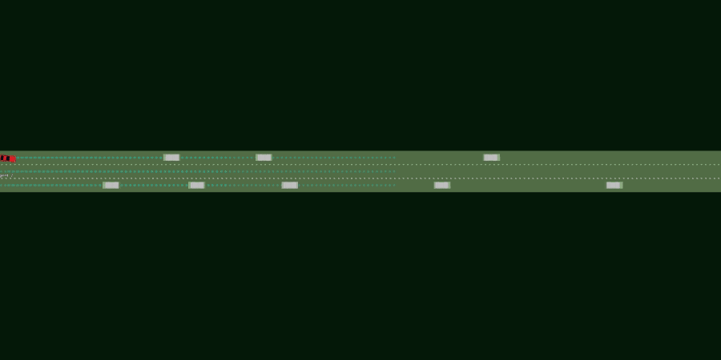
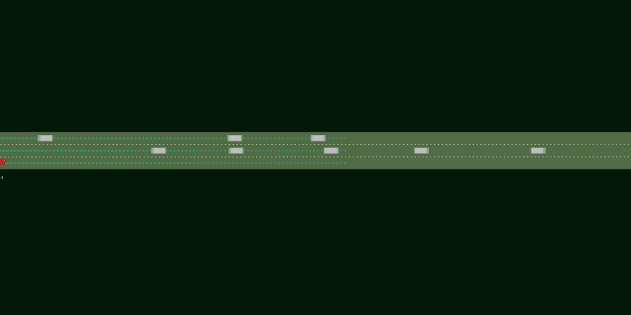
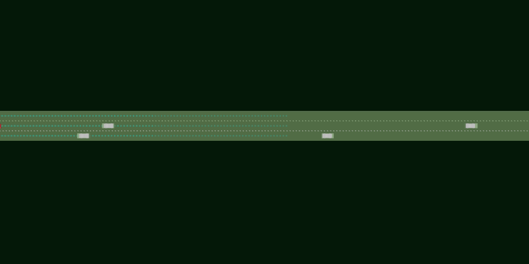

# Track-1

## Objective
Objective is to develop a single policy capable of controlling single-agent or multi-agent to complete different driving scenarios in the `multi-scenario-v0` environment. A `TargetPose` action space must be used for each agent. Refer below for `multi-scenario-v0` environment [details](#environment).

In each driving scenario, the ego-agents must drive towards their respective goal locations. Any method such as reinforcement learning, offline reinforcement learning, behaviour cloning, generative models, predictive models, etc, may be used to develop the policy.

The scenario names and their missions, given for training, are as follows.

- 1_to_2lane_left_turn_c 
    + A single ego agent must make a left turn at an uprotected cross-junction.
- 1_to_2lane_left_turn_t 
    + A single ego agent must make a left turn at an uprotected T-junction.
- 3lane_merge_multi_agent
    + One ego agent must merge onto a 3-lane highway from an on-ramp, while another agent must drive on the highway yielding appropriately to traffic from the on-ramp.
- 3lane_merge_single_agent
    + One ego agent must merge onto a 3-lane highway from an on-ramp.
- 3lane_cruise_multi_agent
    + Three ego agents must cruise along a 3-lane highway with traffic.
- 3lane_cruise_single_agent
    + One ego agents must cruise along a 3-lane highway with traffic.
- 3lane_cut_in
    + One ego agent must navigate (either slow down or change lane) when its path is cut-in by another traffic vehicle.
- 3lane_overtake
    + One ego agent, while driving along a 3-lane highway, must overtake a column of slow moving traffic vehicles and return to the same lane which it started at.

## Example
The setup, train, evaluate, and docker, instructions are meant for getting started. These steps are illustrated by way of an example.

**This example is only meant to demonstrate one potential method of developing a policy for the `multi-scenario-v0` environment. Here, any method such as reinforcement learning, offline reinforcement learning, behaviour cloning, generative models, predictive models, etc, may be used to develop the policy.**

This example uses PPO from [Stable Baselines3](https://github.com/DLR-RM/stable-baselines3) reinforcement learning library. A single trained RL model navigating various scenarios in the `multi-scenario-v0` environment is shown below.

+ 1_to_2lane_left_turn_c

    
+ 1_to_2lane_left_turn_t 

    
+ 3lane_merge_multi_agent

    
+ 3lane_merge_single_agent

    
+ 3lane_cruise_multi_agent

    
+ 3lane_cruise_single_agent

    
+ 3lane_cut_in

    

## Setup
+ Use `python3.8` to develop your model.
+ This example is packaged using its own `setup.py` file.
    ```bash
    $ cd <path>/SMARTS/competition/track1
    $ python3.8 -m venv ./.venv
    $ source ./.venv/bin/activate
    $ pip install --upgrade pip
    $ pip install -e ./train
    ```
+ SMARTS is used as a dependent package.

## Environment
+ Make separate environments for each scenario. 
+ Individual environments can be instantiated as follows, by inserting the name of the desired scenario.
    ```python
    env = gym.make(
        "smarts.env:multi-scenario-v0",
        scenario=<insert-name-of-scenario>,
        img_meters=img_meters, # Optional. Camera sensor ground size. Defaults to 64 meters.
        img_pixels=img_pixels, # Optional. Camera sensor pixel size. Defaults to 256 pixels.
        sumo_headless=True, # If False, enables sumo-gui display. Defaults to True. 
    )
    ```
+ `img_meters` and `img_pixels` are optional parameters used to control the size in meters and in pixels, respectively, of the camera sensor output.
+ SMARTS is multiagent simulator which returns
    + `observations`: Dict[agent_name: agent_observation]
    + `rewards`: Dict[agent_name: agent_reward]
    + `dones`: Dict[agent_name: agent_done, \_\_all\_\_: all_done]
    Here `dones["__all__"]` becomes true when all agents are done, else false.
+ Default reward is distance travelled per step in meters.
+ Action space for each agent: `smarts.core.controllers.ActionSpaceType.TargetPose` a sequence of `[x-coordinate, y-coordinate, heading, and time-delta]`. Use `time-delta=0.1`.
    + ```python
      action_space = gym.spaces.Box(low=np.array([-1e10, -1e10, -π, 0]), high=np.array([1e10, 1e10, π, 1e10]), dtype=np.float32)
      ```
    + ego's next x-coordinate on the map: [-1e10,1e10]
    + ego's next y-coordinate on the map: [-1e10,1e10]
    + ego's next heading with respect to the map's axes: [-π,π]
    + time delta to reach the given pose: [0,1e10]
+ Observation space for each agent: `smarts.core.sensors.Observation`
    + For more details on the contents of `Observation` class, see [here](https://github.com/huawei-noah/SMARTS/blob/comp-1/smarts/core/sensors.py#L208).
+ In each environment, each agent's mission goal is given in the observation returned at each time step. The mission goal could be accessed as `observation.ego_vehicle_state.mission.goal.position` which gives an `(x, y, z)` map coordinate of the goal location.

## Visualize
+ SUMO GUI is used to visualize the simulation. 
    1. While instantiating the environment, set `sumo_headless` to `False`, i.e.,
        ```python 
        env = gym.make(
            "smarts.env:multi-scenario-v0",
            scenario=<insert-name-of-scenario>,
            sumo_headless=False,
        )
        ```
    1. This can be achieved by setting `sumo_gui: True` in the `SMARTS/competition/track1/train/config.yaml` file. 
    1. A SUMO gui will automatically pop up during simulation.

## Train
1. Train
    ```bash
    $ cd <path>/SMARTS/competition/track1
    $ python3.8 train/run.py
    ```
1. Trained model is saved into `<path>/SMARTS/competition/track1/train/logs/<folder_name>` folder.

## Evaluate
1. Run to evaluate your model.
    ```bash
    $ cd <path>/SMARTS/competition/track1
    $ python3.8 train/run.py --mode=evaluate --model="./logs/<folder_name>/<model>"
    ```

## Docker
1. Train a model inside docker
    ```bash
    $ cd <path>/SMARTS
    $ docker build --file=./competition/track1/train/Dockerfile --network=host --tag=multi_scenario .
    $ docker run --rm -it --network=host --gpus=all multi_scenario
    (container) $ cd /src/competition/track1
    (container) $ python3.8 train/run.py
    ```