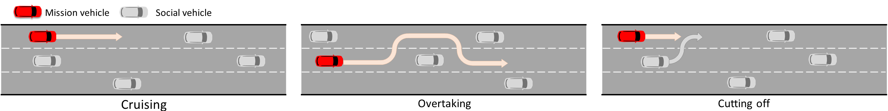
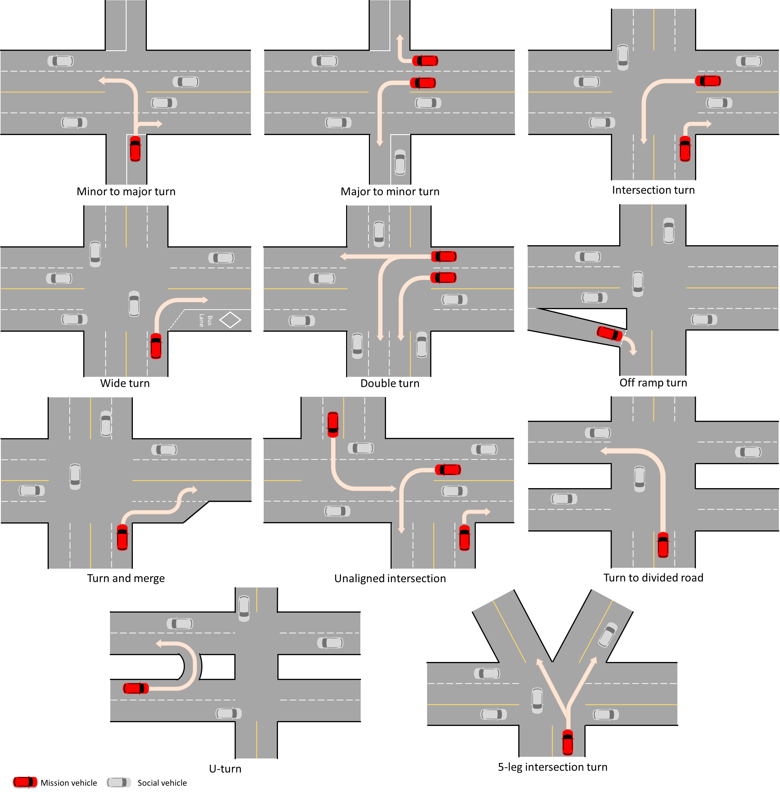

.. _driving_smarts_2023_1:

Driving SMARTS 2023.1 & 2023.2
==============================

Objective
---------

Objective is to develop a single-ego policy capable of controlling a single ego to perform a task in the
``driving-smarts-v2023`` environment. Refer to :func:`~smarts.env.gymnasium.driving_smarts_2023_env.driving_smarts_2023_env`
for environment details. 

.. important::

    In a scenario with multiple egos, a single-ego policy is replicated into every agent. Each agent is stepped
    independently by calling their respective :attr:`~smarts.core.agent.Agent.act` function. In short, multiple
    policies are executed in a distributed manner. The single-ego policy should be capable of accounting for and 
    interacting with other ego vehicles, if any are present.

Each ego should drive towards its assigned mission goal position. The ego's mission goal is provided to
the ego through the mission goal :attr:`~smarts.core.plan.PositionalGoal.position` attribute in the observation
it receives at every step.

An ego is terminated when it reaches its mission goal position. Additionally, the ego terminates whenever
it collides, drives off road, or exceeds maximum number of steps per episode.

**Driving SMARTS 2023.1** focuses on basic motion planning scenarios, such as

+ **Cruise** where the ego maintains a stable driving path to its destination.
+ **Overtake** which involves the ego maneuvering among slower moving background traffic.
+ **Cut-off** where the ego is cut-off by background traffic vehicles and needs to react accordingly.

    Here, egos are in red colour, and background traffic is in silver colour. (Left) Cruise scenario.
    (Middle) Overtake scenario. (Right) Cut-off scenario.

**Driving SMARTS 2023.2** focuses on navigating various type of turns. Some sample turning scenarios are depicted
below.

    Here, egos are in red colour, and background traffic is in silver colour.

Any method such as reinforcement learning, offline reinforcement learning, behaviour cloning, generative models,
predictive models, etc, may be used to develop the policy.

Several scenarios are provided for training. Their names and tasks are as follows. 
The desired task execution is illustrated in a gif by a trained baseline agent. 

.. todo::
    
    Provide sample training scenarios and corresponding gifs showing a baseline model traversing the map.

Observation space
-----------------

The underlying environment returns formatted :class:`~smarts.core.observations.Observation` using 
:attr:`~smarts.env.utils.observation_conversion.ObservationOptions.multi_agent`
option as observation at each time point. See 
:class:`~smarts.env.utils.observation_conversion.ObservationSpacesFormatter` for
a sample formatted observation data structure.

Action space
------------

The action space for an ego agent can be either :attr:`~smarts.core.controllers.ActionSpaceType.Continuous`
or :attr:`~smarts.core.controllers.ActionSpaceType.RelativeTargetPose`. The user should choose
one of the action spaces and specify the chosen action space through the ego agent's interface.

Code structure
--------------

Users are free to use any training method and any folder structure for training the policy.

Only the inference code is required for evaluation, and therefore it must follow the folder 
structure and contain specified file contents, as explained below. The below files and folders
must be present with identical names. Any additional files may be optionally added by 
the user.

.. code-block:: text

    inference                   
    ├── contrib_policy          
    │   ├── __init__.py         
    │   ├── policy.py           
    |   .
    |   .
    |   .
    ├── __init__.py             
    ├── MANIFEST.in              
    ├── setup.cfg                
    └── setup.py                

1. inference/contrib_policy/__init__.py
    + Keep this file unchanged.
    + It is an empty file.

2. inference/contrib_policy/policy.py
    + Must contain a ``class Policy(Agent)`` class which inherits from :class:`~smarts.core.agent.Agent`.

3. inference/__init__.py
    + Must contain the following template code. 
    + The template code registers the user's policy in SMARTS agent zoo.
    
      .. code-block:: python

        from contrib_policy.policy import Policy

        from smarts.core.agent_interface import AgentInterface
        from smarts.core.controllers import ActionSpaceType
        from smarts.zoo.agent_spec import AgentSpec
        from smarts.zoo.registry import register

        def entry_point(**kwargs):
            interface = AgentInterface(
                action=ActionSpaceType.<...>,
                drivable_area_grid_map=<...>,
                lane_positions=<...>,
                lidar_point_cloud=<...>,
                occupancy_grid_map=<...>,
                road_waypoints=<...>,
                signals=<...>,
                top_down_rgb=<...>,
            )

            agent_params = {
                "<...>": <...>,
                "<...>": <...>,
            }

            return AgentSpec(
                interface=interface,
                agent_builder=Policy,
                agent_params=agent_params,
            )

        register(locator="contrib-agent-v0", entry_point=entry_point)

    + User may fill in the ``<...>`` spaces in the template.
    + User may specify the ego's interface by configuring any field of :class:`~smarts.core.agent_interface.AgentInterface`, except
        
      + :attr:`~smarts.core.agent_interface.AgentInterface.accelerometer`, 
      + :attr:`~smarts.core.agent_interface.AgentInterface.done_criteria`, 
      + :attr:`~smarts.core.agent_interface.AgentInterface.max_episode_steps`, 
      + :attr:`~smarts.core.agent_interface.AgentInterface.neighborhood_vehicle_states`, and 
      + :attr:`~smarts.core.agent_interface.AgentInterface.waypoint_paths`. 

4. inference/MANIFEST.in 
    + Contains any file paths to be included in the package.

5. inference/setup.cfg
    + Must contain the following template code. 
    + The template code helps build the user policy into a Python package.
    
      .. code-block:: cfg

        [metadata]
        name = <...>
        version = 0.1.0
        url = https://github.com/huawei-noah/SMARTS
        description = SMARTS zoo agent.
        long_description = <...>. See [SMARTS](https://github.com/huawei-noah/SMARTS).
        long_description_content_type=text/markdown
        classifiers=
            Programming Language :: Python
            Programming Language :: Python :: 3 :: Only
            Programming Language :: Python :: 3.8

        [options]
        packages = find:
        include_package_data = True
        zip_safe = True
        python_requires = == 3.8.*
        install_requires = 
            <...>==<...>
            <...>==<...>

    + User may fill in the ``<...>`` spaces in the template.
    + User should provide a name for their policy and describe it in the ``name`` and ``long_description`` sections, respectively.
    + Do **not** add SMARTS package as a dependency in the ``install_requires`` section.
    + Dependencies in the ``install_requires`` section **must** have an exact package version specified using ``==``.

6. inference/setup.py
    + Keep this file and its default contents unchanged.
    + Its default contents are shown below.

      .. code-block:: python
    
        from setuptools import setup

        if __name__ == "__main__":
            setup()
 
Example
-------

An example training and inference code is provided for this benchmark. 
See the :examples:`rl/drive` example. The example uses PPO algorithm from 
`Stable Baselines3 <https://github.com/DLR-RM/stable-baselines3>`_ reinforcement learning library.
It uses :attr:`~smarts.core.controllers.ActionSpaceType.RelativeTargetPose` action space.
Instructions for training and evaluating the example is as follows.

Train
^^^^^
+ Setup

  .. code-block:: bash

    # In terminal-A
    $ cd <path>/SMARTS/examples/rl/drive
    $ python3.8 -m venv ./.venv
    $ source ./.venv/bin/activate
    $ pip install --upgrade pip
    $ pip install wheel==0.38.4
    $ pip install -e ./../../../.[camera_obs,argoverse]
    $ pip install -e ./inference/

+ Train locally without visualization

  .. code-block:: bash

    # In terminal-A
    $ python3.8 train/run.py

+ Train locally with visualization

  .. code-block:: bash

    # In a different terminal-B
    $ cd <path>/SMARTS/examples/rl/drive
    $ source ./.venv/bin/activate
    $ pip install -e ./../../../.[envision]
    $ scl envision start
    # Open http://localhost:8081/

  .. code-block:: bash

    # In terminal-A
    $ python3.8 train/run.py --head

+ Trained models are saved by default inside the ``<path>/SMARTS/examples/rl/drive/train/logs/`` folder.

Docker
^^^^^^
+ Train inside docker

  .. code-block:: bash

    $ cd <path>/SMARTS
    $ docker build --file=./examples/rl/drive/train/Dockerfile --network=host --tag=drive .
    $ docker run --rm -it --network=host --gpus=all drive
    (container) $ cd /SMARTS/examples/rl/drive
    (container) $ python3.8 train/run.py

Evaluate
^^^^^^^^
+ Choose a desired saved model from the previous training step, rename it as ``saved_model.zip``, and move it to ``<path>/SMARTS/examples/rl/drive/inference/contrib_policy/saved_model.zip``.
+ Evaluate locally

  .. code-block:: bash

    $ cd <path>/SMARTS
    $ python3.8 -m venv ./.venv
    $ source ./.venv/bin/activate
    $ pip install --upgrade pip
    $ pip install -e .[camera_obs,argoverse]
    $ scl zoo install examples/rl/drive/inference
    # For Driving SMARTS 2023.1
    $ scl benchmark run driving_smarts_2023_1 examples.rl.drive.inference:contrib-agent-v0 --auto-install
    # For Driving SMARTS 2023.2
    $ scl benchmark run driving_smarts_2023_2 examples.rl.drive.inference:contrib-agent-v0 --auto-install

Zoo agents
----------

A compatible zoo agent can be evaluated in this benchmark as follows.

.. code-block:: bash

    $ cd <path>/SMARTS
    $ scl zoo install <agent path>
    # For Driving SMARTS 2023.1
    $ scl benchmark run driving_smarts_2023_1==0.0 <agent_locator> --auto_install
    # For Driving SMARTS 2023.2
    $ scl benchmark run driving_smarts_2023_2==0.0 <agent_locator> --auto_install
