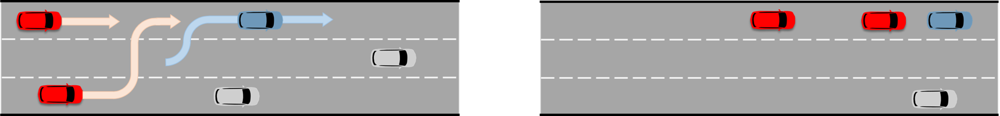

.. _driving_smarts_2023_3:

Driving SMARTS 2023.3
=====================

Objective
---------

Objective is to develop a single-ego policy capable of controlling a single ego to perform a vehicle-following task in the 
``platoon-v0`` environment. Refer to :func:`~smarts.env.gymnasium.platoon_env.platoon_env` for environment details. 

.. important::

    In a scenario with multiple egos, a single-ego policy is replicated into every agent. Each agent is stepped
    independently by calling their respective :attr:`~smarts.core.agent.Agent.act` function. In short, multiple
    policies are executed in a distributed manner. The single-ego policy should be capable of accounting for and 
    interacting with other ego vehicles, if any are present.

All ego agents should track and follow the leader (i.e., lead vehicle) in a single-file fashion. The lead vehicle is 
marked as a vehicle of interest and may be found by filtering the
:attr:`~smarts.core.observations.VehicleObservation.interest` attribute of the neighborhood vehicles in the 
observation.

    Here, egos are in red colour, lead vehicle is in blue colour, and background traffic is in silver colour. 
    (Left) At the start of episode, egos start tracking the lead vehicle. (Right) After a while, egos follow the
    lead vehicle in a single-file fashion.

The episode ends when the leader reaches its destination. Ego agents do not have prior knowledge of the leader's 
destination. Additionally, the ego terminates whenever it collides, drives off road, or exceeds maximum number 
of steps per episode.

Any method such as reinforcement learning, offline reinforcement learning, behaviour cloning, generative models,
predictive models, etc, may be used to develop the policy.

Several scenarios are provided for training. Their names and tasks are as follows. 
The desired task execution is illustrated in a gif by a trained baseline agent. 

+ straight_2lane_agents_1
    A single ego must follow a specified leader, with no background traffic.

    .. image:: /_static/driving_smarts_2023/platoon_straight_2lane_agents_1.gif

Observation space
-----------------

The underlying environment returns formatted :class:`~smarts.core.observations.Observation` using 
:attr:`~smarts.env.utils.observation_conversion.ObservationOptions.multi_agent`
option as observation at each time point. See 
:class:`~smarts.env.utils.observation_conversion.ObservationSpacesFormatter` for
a sample formatted observation data structure.

Action space
------------

Action space for an ego can be either :attr:`~smarts.core.controllers.ActionSpaceType.Continuous`
or :attr:`~smarts.core.controllers.ActionSpaceType.RelativeTargetPose`. User should choose
one of the action spaces and specify the chosen action space through the ego's agent interface.

Code structure
--------------

Users are free to use any training method and any folder structure for training the policy.

Only the inference code is required for evaluation, and therefore it must follow the folder 
structure and contain specified file contents, as explained below. The below files and folders
must be present with identical names. Any additional files may be optionally added by 
the user.

.. code-block:: text

    inference                   
    ├── contrib_policy          
    │   ├── __init__.py         
    │   ├── policy.py           
    |   .
    |   .
    |   .
    ├── __init__.py             
    ├── MANIFEST.in              
    ├── setup.cfg                
    └── setup.py                

1. inference/contrib_policy/__init__.py
    + Keep this file unchanged.
    + It is an empty file.

2. inference/contrib_policy/policy.py
    + Must contain a ``class Policy(Agent)`` class which inherits from :class:`~smarts.core.agent.Agent`.

3. inference/__init__.py
    + Must contain the following template code. 
    + The template code registers the user's policy in SMARTS agent zoo.
    
      .. code-block:: python

        from contrib_policy.policy import Policy

        from smarts.core.agent_interface import AgentInterface
        from smarts.core.controllers import ActionSpaceType
        from smarts.zoo.agent_spec import AgentSpec
        from smarts.zoo.registry import register

        def entry_point(**kwargs):
            interface = AgentInterface(
                action=ActionSpaceType.<...>,
                drivable_area_grid_map=<...>,
                lane_positions=<...>,
                lidar_point_cloud=<...>,
                occupancy_grid_map=<...>,
                road_waypoints=<...>,
                signals=<...>,
                top_down_rgb=<...>,
            )

            agent_params = {
                "<...>": <...>,
                "<...>": <...>,
            }

            return AgentSpec(
                interface=interface,
                agent_builder=Policy,
                agent_params=agent_params,
            )

        register(locator="contrib-agent-v0", entry_point=entry_point)

    + User may fill in the ``<...>`` spaces in the template.
    + User may specify the ego's interface by configuring any field of :class:`~smarts.core.agent_interface.AgentInterface`, except
        
      + :attr:`~smarts.core.agent_interface.AgentInterface.accelerometer`, 
      + :attr:`~smarts.core.agent_interface.AgentInterface.done_criteria`, 
      + :attr:`~smarts.core.agent_interface.AgentInterface.max_episode_steps`, 
      + :attr:`~smarts.core.agent_interface.AgentInterface.neighborhood_vehicle_states`, and 
      + :attr:`~smarts.core.agent_interface.AgentInterface.waypoint_paths`. 

4. inference/MANIFEST.in 
    + Contains any file paths to be included in the package.

5. inference/setup.cfg
    + Must contain the following template code. 
    + The template code helps build the user policy into a Python package.
    
      .. code-block:: cfg

        [metadata]
        name = <...>
        version = 0.1.0
        url = https://github.com/huawei-noah/SMARTS
        description = SMARTS zoo agent.
        long_description = <...>. See [SMARTS](https://github.com/huawei-noah/SMARTS).
        long_description_content_type=text/markdown
        classifiers=
            Programming Language :: Python
            Programming Language :: Python :: 3 :: Only
            Programming Language :: Python :: 3.8

        [options]
        packages = find:
        include_package_data = True
        zip_safe = True
        python_requires = == 3.8.*
        install_requires = 
            <...>==<...>
            <...>==<...>

    + User may fill in the ``<...>`` spaces in the template.
    + User should provide a name for their policy and describe it in the ``name`` and ``long_description`` sections, respectively.
    + Do **not** add SMARTS package as a dependency in the ``install_requires`` section.
    + Dependencies in the ``install_requires`` section **must** have an exact package version specified using ``==``.

6. inference/setup.py
    + Keep this file and its default contents unchanged.
    + Its default contents are shown below.

      .. code-block:: python
    
        from setuptools import setup

        if __name__ == "__main__":
            setup()
 
Example
-------

An example training and inference code is provided for this benchmark. 
See the :examples:`rl/platoon` example. The example uses PPO algorithm from 
`Stable Baselines3 <https://github.com/DLR-RM/stable-baselines3>`_ reinforcement learning library. 
It uses :attr:`~smarts.core.controllers.ActionSpaceType.Continuous` action space.
Instructions for training and evaluating the example is as follows.

Train
^^^^^
+ Setup

  .. code-block:: bash

    # In terminal-A
    $ cd <path>/SMARTS/examples/rl/platoon
    $ python3.8 -m venv ./.venv
    $ source ./.venv/bin/activate
    $ pip install --upgrade pip
    $ pip install -e ./../../../.[camera_obs,argoverse]
    $ pip install -e ./inference/

+ Train locally without visualization

  .. code-block:: bash

    # In terminal-A
    $ python3.8 train/run.py

+ Train locally with visualization

  .. code-block:: bash

    # In a different terminal-B
    $ cd <path>/SMARTS/examples/rl/platoon
    $ source ./.venv/bin/activate
    $ scl envision start
    # Open http://localhost:8081/

  .. code-block:: bash

    # In terminal-A
    $ python3.8 train/run.py --head

+ Trained models are saved by default inside the ``<path>/SMARTS/examples/rl/platoon/train/logs/`` folder.

Docker
^^^^^^
+ Train inside docker

  .. code-block:: bash

    $ cd <path>/SMARTS
    $ docker build --file=./examples/rl/platoon/train/Dockerfile --network=host --tag=platoon .
    $ docker run --rm -it --network=host --gpus=all platoon
    (container) $ cd /SMARTS/examples/rl/platoon
    (container) $ python3.8 train/run.py

Evaluate
^^^^^^^^
+ Choose a desired saved model from the previous training step, rename it as ``saved_model.zip``, and move it to ``<path>/SMARTS/examples/rl/platoon/inference/contrib_policy/saved_model.zip``. 
+ Evaluate locally

  .. code-block:: bash

    $ cd <path>/SMARTS
    $ python3.8 -m venv ./.venv
    $ source ./.venv/bin/activate
    $ pip install --upgrade pip
    $ pip install -e .[camera_obs,argoverse]
    $ scl zoo install examples/rl/platoon/inference
    $ scl benchmark run driving_smarts_2023_3 examples.rl.platoon.inference:contrib-agent-v0 --auto-install

Zoo agents
----------

A compatible zoo agent can be evaluated in this benchmark as follows.

.. code-block:: bash

    $ cd <path>/SMARTS
    $ scl zoo install <agent path>
    $ scl benchmark run driving_smarts_2023_3==0.0 <agent_locator> --auto_install
