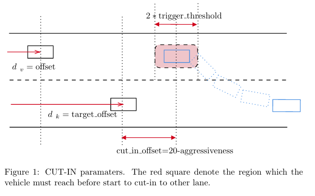
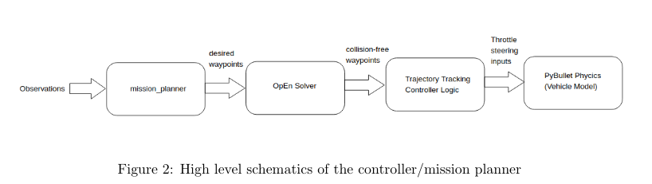
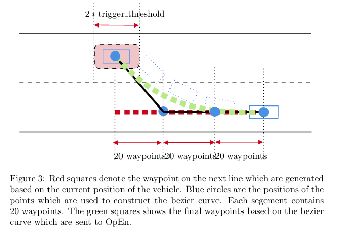
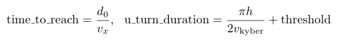
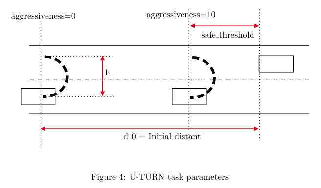
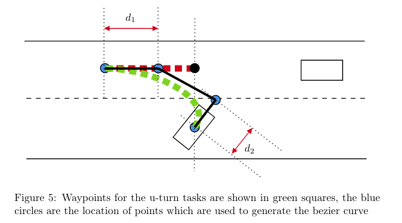

.. role:: red
.. raw:: html

    

Behavorial Models
================
SMARTS can also be used to create various behavorial models that can be used for trainining an RL agent. Here, we present two of such models for u-turn and cut-in tasks.

==========
CUT-IN task
==========

The main objective of the cut-in task is to cut in front of the kyber vehicle us-
ing different level of aggressiveness. If the vehicle is instantiated far in front(or
behind) of the kyber vehicle it needs to slow down(or speed up) to reach the
desired distance which is given by the aggressiveness value defined at the agent
interface level. A typical use case would be as follows:

.. code-block:: python

    open_agent_spec = open_agent.entrypoint(debug=False, aggressiveness=3)

Fig.1 illustrates how we select the main configuration parameters of the cut-in
task, The blue rectangle on the top lane shows the position in which the cut-in
task is triggered. As it is shown in Fig.1 the distance between this point and
the kyber vehicle is equal to :red:`20 − aggressiveness` where aggressiveness changes
between 0 to 10.

Thus at zero aggressiveness the vehicle starts the cut in task at 20 meters
in front of the kyber vehicle on the other lane and at value 10 it starts such
maneuver at 10 meters in front of the kyber vehicle.

Next we break the cut-in task into two phase, in the first phase, where the
vehicle is outside the red rectangle, the objective for the vehicle is to reach to
the desired position in front of the kyber vehicle on the other lane which is de-
fined by aggressiveness(blue rectangle on the top lane). Hence, the vehicle need
to follow the waypoints on its lane but it needs to adjust its speed depending
on its relative position with respect to kyber vehicle. In mission planner.py this
is achieved by using the following desired velocities for the waypoints of the current vehicle lane.

.. code-block:: python

    speed_limit = (target_vehicle.speed * 1.1)
                - 2 * (offset - (cut_in_offset + target_offset)),
                    

A closer look at previous equation reveals that the desired velocity for the vehi-
cle is comprised of two terms, the first one is slightly higher than the value of the
kyber vehicle and the second term is a position based feedback term to ensure
that the vehicle reaches the desired position in front of the kyber vehicle on the
other lane before it initiates the cut-in maneuver. This desired velocity then
will be fed to OpEn optimization engine which modifies the desired waypoints
if needed to ensure the collision avoidance. Finally, the result of OpEn solver
will be sent to trajectory tracking controller to generate the desired inputs for
the vehicle.

In the next phase of the maneuver, i.e. when the vehicle enters the red box,
the vehicle initiates the cut-in maneuver, this is achieved using the following
method for generating the desired waypoints:

After the vehicle enters the red square in Fig.1, a first set of waypoints are
generated (red squares in Fig.1)using the current position of the vehicle and the
target lane(kyber vehicle lane), Next, four points(blue circles in Fig.1) are chosen
to construct the cubic bezier curve for generating the desired waypoints(green
squres in Fig.1) from the current position of the vehicle to the next lane. The
first point is the location of the vehicle. The second/third/fourth points are di-
viding the first set of waypoints (red squares in Fig.1) to three equal segments.
Finally, the desired cubic bezier curve is constructed and the cut-in waypoints
(green squares in Fig.1) are generated. These waypoints then will be sent to
OpEn solver to ensure that no collision will occur with nearby vehicles and the
output trajectory of the OpEn will be fed to trajectory tracking controller to
calculate the amount of throttle and steering needed to generate such behavior.
The throttle and steering input then applied to the vehicle model in pybullet.

========================
Tuning CUT-IN parameters
========================

In this section we describe the cut-in parameters which can be tuned to obtain
different performance:

cut_in_offset
^^^^^^^^^^^^^
the minimum and maximum values for this parameter can
be changed by choosing different values for 20 in its definition as it is
shown in Fig.1

trigger_threshold
^^^^^^^^^^^^^^^^^
This parameter defines the red box in Fig.1 that the
vehicle must be located in to start to cut in to other lane.

P0,P1,P2,P3
^^^^^^^^^^^
The location of points which are used to generate the
bezier curve. The first point P0 must be at the center of the vehicle. The
location of the second point P1 will control the sharpness of the desired
cut in trajectory.

speed_limit
^^^^^^^^^^^
There two important coefficient in the definition of the
speed limit:

.. code-block:: python

    speed_limit = (target_vehicle.speed * 1.1)
                - 2 * (offset - (cut_in_offset + target_offset)),

The coefficient 1.1 defines the desired speed when the vehicle starts its
transition to the other lane. The value 2 has a great impact on the behavior and controls how fast the vehicle reaches to the red box in Fig.1 to initiate
the transition to the other lane.

===========
U-TURN TASK
===========

In u-turn task the main objective for the vehicle is to perform the u-turn maneu-
ver in front of the kyber vehicle based on the different level of aggressiveness.
The main logic for achieving this task is as follows: We defined a flag which
shows whether the u-turn task has been triggered or not, If its value is equal
to False, then the distance between the two vehicle is saved. Next, the algo-
rithm checks whether there is enough time for the vehicle to perform the u-turn
without collision. We can do this by comparing the following values:

If there is not enough time, then the vehicle waits for the kyber vehicle to pass
and then performs the u-turn maneuver. Otherwise, it performs the u-turn
maneuvers at the location which is defined based on the level of aggressiveness
as it is shown in Fig.3. We also considered additional safety thresholds to ensure
adequate amount of the distance between the two vehicle at aggressiveness value
of 10.

As it is clear from Fig.3, the initial horizontal distance between the two
vehicle is equally divided to 10 segments which are representing different level
of aggressiveness. Also, notice that we have deducted a safety threshold from
original distance to ensure that the u-turn can be perform in the presence of
uncertainties, vehicle models/time step mismatch, etc.

After the vehicle reached to the triggering distance, then a new set of waypoints
will be generated according to the Fig.5

The logic for generating the waypoints are as follows: After the distance
between the two vehicle reaches to the desired values based on aggressiveness,
a set of waypoints(red squares in Fig.5) are generated at the top lane with the
same offset as the centre of the vehicle. Next, four points are chosen to generate
the bezier curve, The first point is at the location of the center of the vehicle,
the second point is located at the distance d 2 in front of the vehicle. The fourth
point is located at the last waypoint on the other lane(red squares) and the
third point is exactly behind it at distance d 1 , both d 1 and d 2 can be tuned
to obtained different trajectories. finally, the bezier curve is discretized to the
green squares in Fig.5 and through the same mechanism as shown in Fig.2, the
result will be given to other modules.

========================
Tuning U-TURN parameters
========================

There are several parameters which can be tuned for the u-turn task.

safe_threshold
^^^^^^^^^^^^^^
If this variable decreased then at aggressiveness value
of 10 the u-turn maneuver can happen in a closer distance, note that
decreasing this value beyond a certain limit(depending on the veloci-
ties,distance,etc.) can cause collision or waiting for the kyber vehicle to
pass.

d1
^^
This parameter shows the distance between the last red squares and
the third point which is used for generating the bezier curve, increasing
this value will result in more smoother transition to the other lane but the
radius of the turn will be increased.

d2
^^
This is the distance between the first two points for the bezier curve.
If the value is increased it results in a smoother transition curve as the
radius of turn will be increased.

u_turn_speed
^^^^^^^^^^^^
This is the speed during the u-turn maneuver. Currently,
it is set to the half of the initial speed of the vehicle. Note that increasing
the u-turn speed may result in the overshoot during the transition if the
values of d1 and d2 are not adjusted accordingly.
