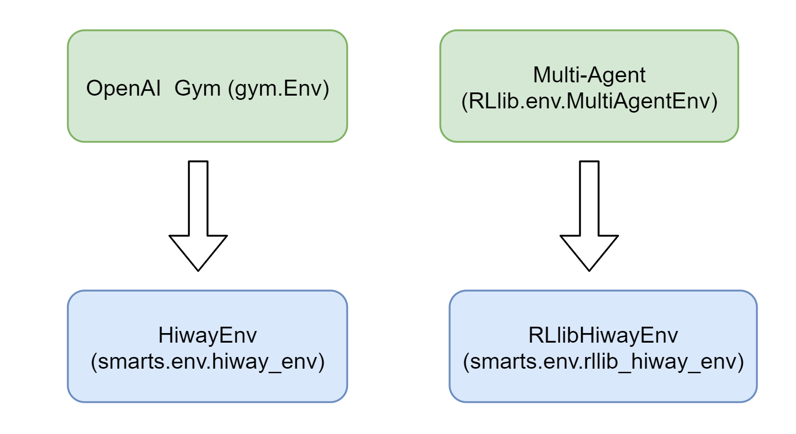

.. _environment:

SMARTS Environment
==================

=====================
Provided Environments
=====================

SMARTS Environment module is defined in `smarts/env`. Currently SMARTS provide two kinds of training 
environments, one is `HiwayEnv` with `gym.env` style interface and another is `RLlibHiwayEnv` customized for `RLlib` training.

HiwayEnv
--------

`HiwayEnv` inherit class `gym.Env` and supports common APIs like `reset`, `step`, `close`. A usage example is shown below.
See :class:`smarts.env.hiway_env` for more details.

.. code-block:: python

    # make env
    env = gym.make(
            "smarts.env:hiway-v0", # env entry name
            scenarios=[scenario_path], # a list of paths to folders of scenarios
            agent_specs={AGENT_ID: agent_spec}, # dictionary of agents to interact with the environment
            headless=False, # headless mode. False to enable Envision visualization of the environment
            visdom=False, # Visdom visualization of observations. False to disable. only supported in HiwayEnv.
            seed=42, # RNG Seed, seeds are set at the start of simulation, and never automatically re-seeded.
        )

    # reset env and build agent
    observations = env.reset()
    agent = agent_spec.build_agent()

    # step env
    agent_obs = observations[AGENT_ID]
    agent_action = agent.act(agent_obs)
    observations, rewards, dones, _ = env.step({AGENT_ID: agent_action})

    # close env
    env.close()

RLlibHiwayEnv
-------------

`RLlibHiwayEnv` inherits from `MultiAgentEnv`, which is defined in RLlib. It also supports common env APIs like `reset`, 
`step`, `close`. A usage example is shown below. See :class:`smarts.env.rllib_hiway_env` for more details.

.. code-block:: python

    from smarts.env.rllib_hiway_env import RLlibHiWayEnv
    env = RLlibHiWayEnv(
        config={
            "scenarios": [scenario_path], # scenarios list
            "agent_specs": {AGENT_ID: agent_spec}, # add agent specs
            "headless": False, # enable envision gui, set False to enable.
            "seed": 42, # RNG Seed, seeds are set at the start of simulation, and never automatically re-seeded.
        }
    )

    # reset env and build agent
    observations = env.reset()
    agent = agent_spec.build_agent()

    # step env
    agent_obs = observations[AGENT_ID]
    agent_action = agent.act(agent_obs)
    observations, rewards, dones, _ = env.step({AGENT_ID: agent_action})

    # close env
    env.close()

====================
Environment features
====================

Flexible Training
-----------------

Since SMARTS environments inherit from either `gym.Env` or `MultiAgentEnv`, they are able to provide common APIs to support single-agent 
and multi-agent RL training. Also, by leveraging Ray and RLlib, `RLlibHiwayEnv` comes with out-of-the-box scalability and multi-instances 
training on multi-cores.

Scenario Iterator
-----------------

If a path to a folder that contains multiple scenarios is passed through the `Env` config, then SMARTS will automatically cycle these
scenarios.

.. code-block:: python

    # train each worker with different environmental setting
    tracks_dir = [scenario1, scenario2, ...]

    tune_config = {
        "env": RLlibHiwayEnv,
        "env_config": {
            "seed": tune.randint(1000),
            "scenarios": tracks_dir,
            "headless": args.headless,
            "agent_specs": agent_specs,
        },
        ...
    }

Specifically, the next scenario will be automatically loaded after each call to `env.reset()`. This is especially useful for
training on multiple maps. Also if there are **n** routes file in `scenario1/traffic` dir, then each routes file will be combined with
the shared map to form a scenario, leading to a total of **n** concrete scenarios (traffic-map combination) that SMARTS automatically
swaps through for just `scenario1`. See :class:`smarts.core.scenario` for implementation details.

In contrast to the above case, we can also use multiple maps for *different workers* together with RLlib as follows:

.. code-block:: python

    # train each worker with different environmental setting
    tracks_dir = [scenario1, scenario2, ...]

    class MultiEnv(RLlibHiWayEnv):
        def __init__(self, env_config):
            env_config["sumo_scenarios"] = [tracks_dir[(env_config.worker_index - 1)]]
            super(MultiEnv, self).__init__(config=env_config)

    tune_config = {
        "env": MultiEnv,
        "env_config": {
            "seed": tune.randint(1000),
            "scenarios": tracks_dir,
            "headless": args.headless,
            "agent_specs": agent_specs,
        },
        ...
    }

These two ways are different. In the first way, samples are collected from different scenarios *across time*, but in the second way
different workers can be collecting sampels from different scenarios *simultaneously* thanks to distributed computing of multiple workers.
This means that in the first case, the agent will be getting experiences from the same scenarios, whereas in the second case, it will
already get a mixture of experiences from different scenarios.

Vehicle Diversity
-----------------

SMARTS environments allow three types of vehicles to exist concurrently, which are **ego agents** under the control of RL model currently
in training , **social agents** controlled by (trained) models from the "Agent Zoo", and **traffic vehicles** controlled by the underlying
traffic simulator SUMO. 

Ego agents are controlled by our training algorithms, and are able to interact with environment directly. Like ego agents, social agents 
also use AgentInterface to register with the environment and interact with it through standard observation and action messages, except
that they are driven by trained models and act in separate `Ray` processes, hence they can provide behavioral characteristics we want.
Traffic vehicles are controlled by SUMO with the features SUMO provided, such as predefined traffic routes and vehicle types. To see more 
details about generation of traffic vehicles and control of their behavior, see our [Scenario Studio](ScenarioStudio.md).

Envision and Logging
--------------------

See [Visiualization](Visualization.md).

Flexible User Customation
-------------------------

See :ref:`agent`.