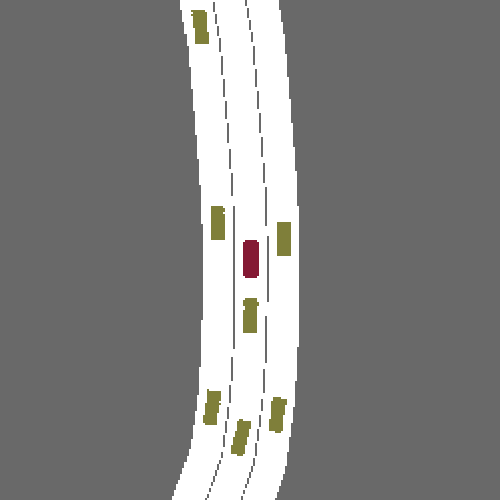

.. _observations:

Standard Observations and Actions
=================================

We have introduced `AgentInterface` in :ref:`agent` which allows us to choose from the standard observation and action types for communication
between an agent and a SMARTS environment.

============
Observations
============

Here we will introduce details of available observation types.
For `AgentType.Full`, which contains the most concrete observation details, the raw observation returned
is a Python `NamedTuple` with the following fields:

* `events` a `NamedTuple` with the following fields:
    * `collisions` - collisions the vehicle has been involved with other vehicles (if any)
    * `off_road` - `True` if the vehicle is off the road
    * `reached_goal` - `True` if the vehicle has reached its goal
    * `reached_max_episode_steps` - `True` if the vehicle has reached its max episode steps
* `ego_vehicle_state` - a `VehicleObservation` `NamedTuple` for the ego vehicle with the following fields:
    * `id` - a string identifier for this vehicle
    * `position` - A 3D numpy array (x, y, z) of the center of the vehicle bounding box's bottom plane
    * `bounding_box` - `BoundingBox` data class for the `length`, `width`, `height` of the vehicle
    * `heading` - vehicle heading in radians
    * `speed` - agent speed in m/s
    * `steering` - angle of front wheels in radians
    * `yaw_rate` - rotational speed in radian per second
    * `lane_id` - a globally unique identifier of the lane under this vehicle 
    * `lane_index` - index of the lane under this vehicle, right most lane has index 0 and the index increments to the left
    * `linear_velocity` - A 3D numpy array of vehicle velocities in body coordinate frame
    * `angular_velocity` - A 3D numpy array of angular velocity vector
    * `linear_acceleration` - A 3D numpy array of linear acceleration vector (requires accelerometer sensor)
    * `angular_acceleration` - A 3D numpy array of angular acceleration vector (requires accelerometer sensor)
    * `linear_jerk` - A 3D numpy array of linear jerk vector (requires accelerometer sensor)
    * `angular_jerk` - A 3D numpy array of angular jerk vector (requires accelerometer sensor)
* `neighborhood_vehicle_states` - a list of `VehicleObservation` `NamedTuple`s, each with the following fields:
    * `position`, `bounding_box`, `heading`, `speed`, `lane_id`, `lane_index` - the same as with `ego_vehicle_state`
* `GridMapMetadata` - Metadata for the observation maps with the following information,
    * `created_at` - time at which the map was loaded
    * `resolution` - map resolution in world-space-distance/cell
    * `width` - map width in # of cells
    * `height` - map height in # of cells
    * `camera_pos` - camera position when project onto the map
    * `camera_heading_in_degrees` - camera rotation angle along z-axis when project onto the map
* `top_down_rgb` - contains an observation image with its metadata
    * `metadata` - `GridMapMetadata`
    * `data` - a RGB image (default 256x256) with the ego vehicle at the center

* `occupancy_grid_map` - contains an observation image with its metadata
    * `metadata` - `GridMapMetadata`
    * `data` - An `OGM <https://en.wikipedia.org/wiki/Occupancy_grid_mapping>`_ (default 256x256) around the ego vehicle
* `drivable_area_grid_map` - contains an observation image with its metadata
    * `metadata` - `GridMapMetadata`
    * `data` - A grid map (default 256x256) that shows the static drivable area around the ego vehicle
* `waypoint_paths` - A list of waypoints in front of the ego vehicle showing the potential routes ahead. Each item is a `Waypoint` instance with the following fields:
    * `id` - an integer identifier for this waypoint
    * `pos` - a numpy array (x, y) center point along the lane
    * `heading` - heading angle of lane at this point (radians)
    * `lane_width` - width of lane at this point (meters)
    * `speed_limit` - lane speed in m/s
    * `lane_id` - a globally unique identifier of lane under waypoint
    * `right_of_way` - `True` if this waypoint has right of way, `False` otherwise
    * `lane_index` - index of the lane under this waypoint, right most lane has index 0 and the index increments to the left

See implemention in :class:`smarts.core.sensors`

Then, you can choose the observations needed through :class:`smarts.core.agent_interface.AgentInterface` and process these raw observations through :class:`smarts.core.observation_adapter`.

=======
Rewards
=======
The reward from smarts environments is given by a calculation within smarts; `env_reward` from smarts environments directly uses the reward from smarts. The given reward is 0 or `reward < -0.5` or `reward > 0.5` relating to distance traveled in meters on the step that a vehicle has gone at least 0.5 meters since the last given non-zero reward.

=======
Actions
=======

* `ActionSpaceType.Continuous`: continuous action space with throttle, brake, absolute steering angle. It is a tuple of `throttle` [0, 1], `brake` [0, 1], and `steering` [-1, 1].
* `ActionSpaceType.ActuatorDynamic`: continuous action space with throttle, brake, steering rate. Steering rate means the amount of steering angle change *per second* (either positive or negative) to be applied to the current steering angle. It is also a tuple of `throttle` [0, 1], `brake` [0, 1], and `steering_rate`, where steering rate is in number of radians per second.
* `ActionSpaceType.Lane`: discrete lane action space of *strings* including "keep_lane",  "slow_down", "change_lane_left", "change_lane_right" as of version 0.3.2b, but a newer version will soon be released. In this newer version, the action space will no longer consist of strings, but will be a tuple of an integer for `lane_change` and a float for `target_speed`.
