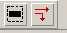

.. _scenario_studio:

Scenario Studio
===============

The Scenario Studio of SMARTS is a stand alone package (`sstudio`) that supports flexible and expressive scenario specification.
If you have access to `sstudio` you can use it to generate traffic with different traffic vehicle numbers and routes, and agent missions.

================
Generate traffic
================

.. code-block:: python

  traffic_actor = TrafficActor(name="car", speed=Distribution(sigma=0.2, mean=0.8),)

  # add 10 social vehicles with random routes.
  traffic = Traffic(
      flows=[
          # generate flows last for 10 hours
          Flow(route=RandomRoute(), begin=0, end=10 * 60 * 60, rate=25, actors={traffic_actor: 1},)
          for i in range(10)
      ]
  )

  gen_traffic(scenario_path, traffic, name="all", output_dir=scenario_path, seed=seed_, overwrite=True)

`traffic_actor` is used as a spec for traffic actors (e.g. Vehicles, Pedestrians, etc). The defaults provided are for a car.
You can specify acceleration, deceleration, speed distribution, imperfection distribution and other configs for social cars.
See more config for `TrafficActor` in :class:`smarts.sstudio.types`.

Flow can be used to generate repeated vehicle runs on the same route, you can config vehicle route and depart rate here. 

After the `gen_traffic` function is run, a dir named "traffic" containing vehicle config xmls will be created under output_dir.
 

This a short file example of how it works:

.. literalinclude:: ../minimal_scenario_studio.py
   :language: python

We just run a `scenario.py` file as a regular Python script to generate scenarios:

.. code-block:: bash

  python3 scenario/scenario.py

IMPORTANT: if you want to train model on one scenario, remember to set the `end` time of flow larger or equal to your expected
training time, since SMARTS will continue the flow after each `reset` called. However, if there are multi scenarios to train
for one worker, you can relax this restriction since after the scenario change, the flow will also be reset to the beginning time.

=================
Generate missions
=================

The Scenario Studio of SMARTS also allows generation of *missions* for ego agents and social agents. These missions are similar
to routes for social vehicles. When we run `gen_missions`, "missions.rou.xml" file will be created under the output dir:

.. code-block:: python

  # agent missions
  gen_missions(
      scenario,
      missions=[Mission(Route(begin=("edge0", 0, "random"), end=("edge1", 0, "max"),)),],
      seed=seed_,
  )

=====================
Generate friction map
=====================

The Scenario Studio of SMARTS also allows generation of *friction map* which consists of a list of *surface patches* for ego agents and social agents. These surface patches are using PositionalZone as in the case of bubbles. When we run `gen_friction_map`, "friction_map.pkl" file will be created under the output dir:

.. code-block:: python

  # friction map
  gen_friction_map(
      scenario,
      surface_patches=[RoadSurfacePatch(PositionalZone(pos=(153, -100), size=(2000, 6000)),
      begin_time=0,
      end_time=20,
      friction_coefficient=0.5)]
  )

===============
Edit SUMO maps
===============

To enrich your training datasets, you can edit your own map through [SUMO's NETEDIT](https://sumo.dlr.de/docs/NETEDIT.html) and export it in a map.net.xml format.
And if you have an additional file you wish to turn into a map you can use the conversion utility `sumo2mesh.py` like this:

.. code-block:: bash

  python3 -m smarts.sstudio.sumo2mesh dataset_public/2lane_sharp/map.net.xml dataset_public/2lane_sharp/map.glb --format=glb
  python3 -m smarts.sstudio.sumo2mesh dataset_public/2lane_sharp/map.net.xml dataset_public/2lane_sharp/map.egg --format=egg

The following describes a few basic operations to edit maps

First, to start `netedit`, run the following on terminal:

.. code-block:: bash

  netedit

On the top left bar, "file" -> "new network" to create a new map. 

Use shortcut key "e" to change to edge mode. Click "chain" and "two-way" icons located on the far right of top tool bar, shown in the image below:

Then click on map to start creating new edges and lanes.

Edit existing maps:

"file" -> "Open Network..." to open an existing map. 

Click on the inspect icon to enable inspect mode

Click on any edge to inspect detail and modify properties.

.. image:: ../_static/map_lane.png

The selected block is an edge with id "gneE72". It contains 3 lanes with lane index 0, 1, 2.

To modify the properties, for example change the number of lanes to 2 lanes by changing 3 to 2 on the "numLanes" field, and press
"enter" to make the change. Then press "ctrl+s" to save. Finally, make sure to rebuild the scenario.

.. code-block:: bash

  scl scenario build --clean <path-to-scenario-folder>

To create custom connections between edges, first click the following icon on top bar:

The first lane you select would be the source lane, highlighted in blue. Then select other lanes as target lanes to connect to.

.. image:: ../_static/create_connection.png

=====================
Create traffic routes
=====================

For example, using the following `Route` definition:

.. code-block:: python
  
  Route(begin=("gneE72", 0, "random"), end=("edge2", 1, "max"),)

`begin=("gneE72", 0, "random")` defines the route to start on edge with id `gneE72` and at lane index `0`, 
which is the same lane as the selected lane in the figure above. `"random"` here specifies the amount of offset on the lane to start the route.
