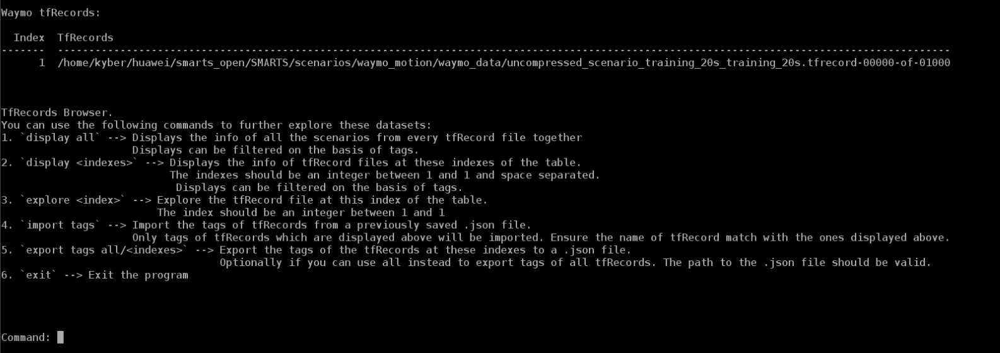
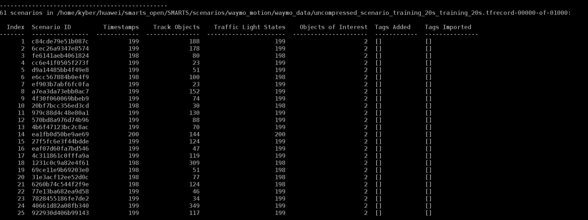
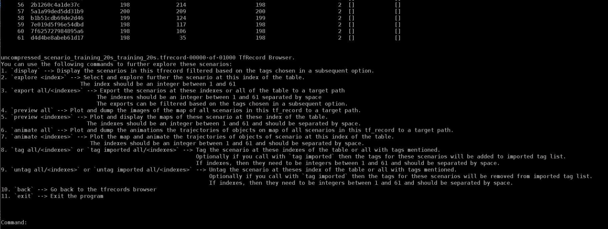
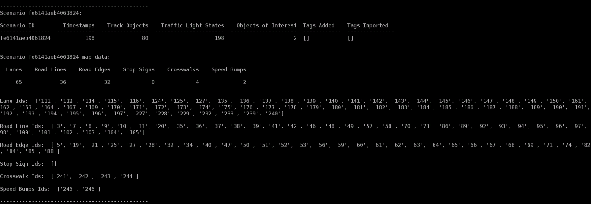
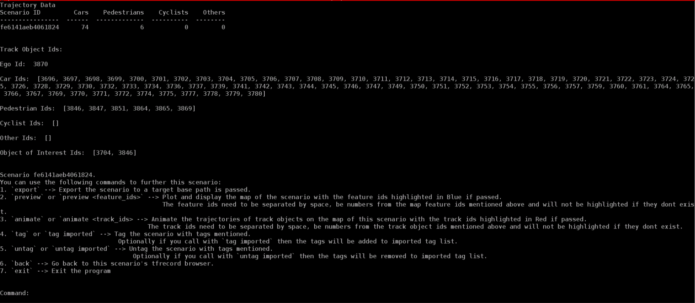

# Text-Based Browser For Waymo Dataset
This is a text-based utility to browse and explore Waymo TFRecord datasets and export them to SMARTS scenarios.
Users are able to tag scenarios based on their interactive behavior and export and import their tags to a JSON file.

## Setup

The utility is independent of SMARTS and only has two dependencies.  You can install the `[waymo]` dependencies of SMARTS to install the `waymo-dataset` and `tabulate` packages using the following command:

```bash
pip install -e .[waymo]
```

Next, download the dataset files from [Waymo Motion Dataset](https://waymo.com/open/download/#) to the folder `scenarios/waymo_motion/waymo_data` or your folder of choice. It is recommended to download the dataset files from the `uncompressed/scenario/training_20s` folder as they have the full traffic capture for each scenario.

## Running the Utility:
It is recommended to run this script from the root or source level directory of the repo. The script can be run using the following command:
```bash
python scenarios/waymo_motion/waymo_utility.py <path/to/waymo_dataset_directories> --target-base-path=<default/path/to/export/scenarios> --import-tags=<path/to/tag/containing/json/file/>
```
Ex:
```bash
python scenarios/waymo_motion/waymo_utility.py scenarios/waymo_motion/waymo_data
```

Or you can also use the scl command line at the source directory to launch the browser:
```bash
scl scenario browse-waymo <path/to/waymo_dataset_directories> -t=<default/path/to/export/scenarios> -i=<path/to/tag/containing/json/file/>
```
Ex:
```bash
scl scenario browse-waymo scenarios/waymo_motion/waymo_data
```
Some things to keep in mind:
* You can pass in multiple paths to datasets which can be either TFRecord files or directories. The paths need to be separated by space.
* `--target-base-path=<default/path/to/export/scenarios>` is an optional argument that can be passed to have a default target path to export scenarios, map images, and trajectory animations of all scenarios of a TFRecord file. The path passed must be a valid directory path that exists.
* `--import-tags=<path/to/tag/containing/json/file/>` is an optional argument that can be passed to pre-import tags for scenarios of a TFRecord file. The path should be a .json file which contains a dictionary of structure `Dict["TFRecord Basename", Dict["Scenario ID", List["Tags"]]]`. Make sure the basename of the TFRecord files has not been modified.

## TFRecord Browser
After running the program the first browser you will see is the `TFRecord Browser` which shows all the TFRecords you loaded in and the commands you can use to browse them further:


Commands you can execute at this level:
1. `display all` &rarr; This displays the info of all the scenarios from every TFRecord file together. Displays can be filtered on the basis of tags which will be asked in the subsequent prompt.
2. `display <indexes>` &rarr; This displays the info of TFRecord files at these indexes of the table. Displays can be filtered on the basis of tags which will be asked in the subsequent prompt.
3. `explore <index>` &rarr; Explore the TFRecord file at this index of the table. This opens up another browser, `TFRecord Explorer`. The index passed should be an integer between 1 and the number of TFRecord files loaded in. You can see the total in the table printed above.
4. `import tags` &rarr; Import the tags of TFRecords from a previously saved .json file. Only tags of TFRecords which are displayed above will be imported. Ensure the names of the TFRecords match with the ones displayed above. If the filenames of the TFRecords don't match the ones loaded in, they won't be displayed.
5. `export tags all/<indexes>` &rarr; Export the tags of the TFRecords at these indexes to a .json file. Optionally you can use all instead to export tags of all TFRecords. You will be asked to pass in the path to the .json file in a subsequent prompt where the path passed should be valid. An example of how the tags will be imported:
```json
{
  "uncompressed_scenario_training_20s_training_20s.tfrecord-00000-of-01000": {
    "c84cde79e51b087c": [
      "2d"
    ],
    "6cec26a9347e8574": [
      "2d"
    ],
    "fe6141aeb4061824": [
      "2d"
    ],
    "cc6e41f0505f273": [
      "2d"
    ],
    "d9a14485bb4f49e8": [
      "2d"
    ]
  }
}
```
6. `exit` &rarr; To exit the program. You can also exit the program at any time by pressing `Ctrl + D`.

## TFRecord Explorer
After selecting the TFRecord to explore further, the second browser you will see is the `TFRecord Explorer` which shows the scenario info of all the scenarios in this file and the commands you can use to explore them further:

.\
.\
.\


Commands you can execute at this level:
1. `display` &rarr; This displays the scenarios in this TFRecord filtered based on the tags chosen in a subsequent prompt.
2. `explore <index>` &rarr; Select and explore further the scenario at this index of the table. This opens up the third browser, `Scenario Explorer`. The index should be an integer between 1 and the total number of scenarios displayed above.
3. `export all/<indexes>` &rarr; This command lets you export the scenarios at these indexes (or all the scenarios if used with `all`) to a target path. If you have run the script with `--target-base-path` option, the subsequent prompt will ask if you want to use a custom path or use the default path passed. The indexes should be an integer between 1 and the total number of scenarios displayed above, separated by space. The exports can also be filtered based on the tags chosen in a subsequent prompt. This will create a `<SCENARIO_ID>` directory at the path passed for every scenario and will consist of two files, `<SCENARIO_ID>/scenario.py` for scenario creation in `SMARTS`:
```python
from pathlib import Path
import yaml
import os
    
from smarts.sstudio.genscenario import gen_scenario
from smarts.sstudio.types import Scenario, MapSpec

yaml_file = os.path.join(Path(__file__).parent, "waymo.yaml")
with open(yaml_file, "r") as yf:
    dataset_spec = yaml.safe_load(yf)["trajectory_dataset"]

dataset_path = dataset_spec["input_path"]
scenario_id = dataset_spec["scenario_id"]

gen_scenario(
    Scenario(
        map_spec=MapSpec(source=f"{dataset_path}#{scenario_id}", lanepoint_spacing=1.0),
        traffic_histories=["waymo.yaml"],
    ),
    output_dir=str(Path(__file__).parent),
    overwrite=True,
)
```
   And `<SCENARIO_ID>/waymo.yaml` for generating history dataset and imitation learning aspects of `SMARTS`:
```yaml
trajectory_dataset:
source: Waymo
input_path: ./waymo_dataset/uncompressed_scenario_training_20s_training_20s.tfrecord-00001-of-01000
scenario_id: <SCENARIO_ID>
```
Where the `input_path` and `scenario_id` will be modified accordingly.

4. `preview all` &rarr; Plot and dump the images of the map of all scenarios in this TFRecord to a target path which you will be asked in a subsequent prompt. If you have run the script with `--target-base-path` option, the subsequent prompt will ask if you want to use a custom path or use the default path passed.
5. `preview <indexes>` &rarr; Plot and display the maps of these scenarios at these index of the table. Each map will be displayed in a separate GUI window of `matplotlib` and you can only use other commands after closing all the plots. The indexes should be an integer between 1 and the total number of scenarios displayed above and should be separated by space.
6. `animate all` &rarr; Plot and dump the animations of the trajectories of objects on the map of all scenarios in this TFRecord to a target path which you will be asked in a subsequent prompt. If you have run the script with `--target-base-path` option, the subsequent prompt will ask if you want to use custom path or use the default path passed.
7. `animate <indexes>` &rarr; Plot and animate the trajectories of objects on the map of scenario at this index of the table. Each animation will be displayed in a separate GUI window of `matplotlib` and you can only use other commands after closing all the plots. The indexes should be an integer between 1 and the total number of scenarios displayed above and should be separated by space.
8. `tag all/<indexes>` or `tag imported all/<indexes>` &rarr; Tag the scenarios by adding the tags to their `Tags Added` list at these indexes of the table (or all the scenarios if used with `all`). Optionally if you call with `tag imported` then the tags for these scenarios will be added to `Imported Tags` list seen above. If indexes, then they need to be integers between 1 and the total number of scenarios displayed above and should be separated by space. You will be asked to input the tags in a subsequent prompt, and they should be separated by space.
9. `untag all/<indexes>` or `untag imported all/<indexes>` &rarr; Untag the scenarios at these indexes of the table (or all the scenarios if used with `all`) by removing the tags from `Tags Added` list. Optionally if you call with `untag imported` then the tags for these scenarios will be removed from `Imported Tags` list seen above. If indexes, then they need to be integers between 1 and the total number of scenarios displayed above and should be separated by space. You will be asked to input the tags in a subsequent prompt, and they should be separated by space.
10. `back` &rarr; Go back to the `TFRecords Browser`.
11. `exit` &rarr; Exit the program. You can also exit the program at any time by pressing `Ctrl + D`.

## Scenario Explorer
After selecting the scenario to explore further, the third browser you will see is the `Scenario Explorer` which shows the total number of different map features and their IDs, and the total number of different track objects and their IDs in the scenario:



Commands you can execute at this level:
1. `export` &rarr; Export the scenario to a target base path asked to input in a subsequent prompt. If you have run the script with the `--target-base-path` option, the subsequent prompt will ask if you want to use custom path or use the default path passed.
2. `preview` or `preview <feature_ids>` &rarr; Plot and display the map of the scenario with the feature IDs highlighted in **Blue** if provided. The feature IDs need to be separated by space, be numbers from the map feature IDs mentioned above and will not be highlighted if they don't exist.
3. `animate` or `animate <track_ids>` &rarr; Animate the trajectories of track objects on the map of this scenario with the track IDs highlighted in **Red** if provided. The ego vehicle will be higlighted in **Cyan** and objects of interests in **Green**. The track IDs need to be separated by space, be numbers from the track object IDs mentioned above and will not be highlighted if they don't exist.
4. `tag` or `tag imported` &rarr; Tag the scenario by adding the tags to `Tags Added` list. Optionally if you call with `tag imported` then the tags will be added to `Imported Tags` list seen above. You will be asked to input the tags in a subsequent prompt, and they should be separated by space.
5. `untag` or `untag imported` &rarr; Untag the scenarios at these indexes of the table (or all the scenarios if used with `all`) by removing them from the `Tags Added` list. Optionally if you call with `tag imported` then the tags for these scenarios will be removed from the `Imported Tags` list seen above. You will be asked to input the tags in a subsequent prompt, and they should be separated by space.
6. `back` &rarr; Go back to the TFRecord browser.
7. `exit` &rarr; Exit the program. You can also exit the program at any time by pressing `Ctrl + D`.

## Additional Notes:
* All commands are case-sensitive but have specific rules to be matched with the user's input. 
* Space between words or parameters for commands can be variable but may lead to invalid command.
* When downloading the dataset, make sure not to change the name of the TFRecord files as they are used for matching TFRecord names when importing tags.
* .json file having the tags for TFRecords scenarios need to have the specific dictionary structure mentioned above.
* `animate <indexes>` command is relatively slow so it is recommended to animate only a small number of scenarios together.
* Do not modify files in `scenarios/waymo_motion/templates` as it contains the templates for `scenario.py` and `waymo.py` that are exported during the `export` command.
```
