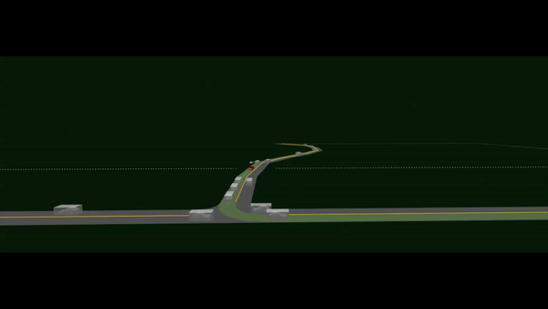

# ULTRA

## Unprotected Left Turn for Robust Agents

Ultra provides a gym-based environment using SMARTS for tackling intersection navigation and more specifically unprotected left turn.

Here is the summary of key features:
 - Customizable scenarios with different levels of difficulty.
 - Analysis tools to evaluate traffic designs including low-mid-high densities.
 - Tools to support analyzing social-vehicle behaviors.
 - Configurable train and test parameters.
 - Benchmark results to train and test custom RL algorithms against.

<p align="center">
  
</p>

## Index

Get started by choosing an option below.
- [Flowchart of ULTRA's interface with SMARTS](docs/_static/ULTRA-flowchart-v1.jpg)
- [Setting up ULTRA](docs/setup.md)
- [Train and Evaluate a Baseline Agent](docs/getting_started.md)
- [Create a Custom Agent](docs/custom_agent.md)
- [More about ULTRA Agents](docs/agent.md)
- [ULTRA supports RLlib](docs/rllib.md)
- [Multi-agent Experiments in ULTRA](docs/multiagent.md)

### Citing ULTRA
For a longer introduction to ULTRA, including its purpose, concepts, and benchmarks, please see [ULTRA: A reinforcement learning generatlization benchmark for autonomous driving](https://ml4ad.github.io/files/papers2020/ULTRA:%20A%20reinforcement%20learning%20generalization%20benchmark%20for%20autonomous%20driving.pdf).

If you use ULTRA in your research, you can use to the following citation.
```
@misc{elsayed20_ultra,
  author          = {Elsayed, Mohamed and Hassanzadeh, Kimia and Nguyen, Nhat M,
                  and Alban, Montgomery and Zhu, Xiru and Graves, Daniel and
                  Luo, Jun},
  journal         = {Machine Learning for Autonomous Driving Workshoo, Neural
                  Information Processing Systems},
  title           = {ULTRA: A reinforcement learning generalization benchmark
                  for autonomous driving},
  url             = {https://ml4ad.github.io/files/papers2020/ULTRA: A
                  reinforcement learning generalization benchmark for autonomous
                  driving.pdf},
  year            = 2020,
}
```
