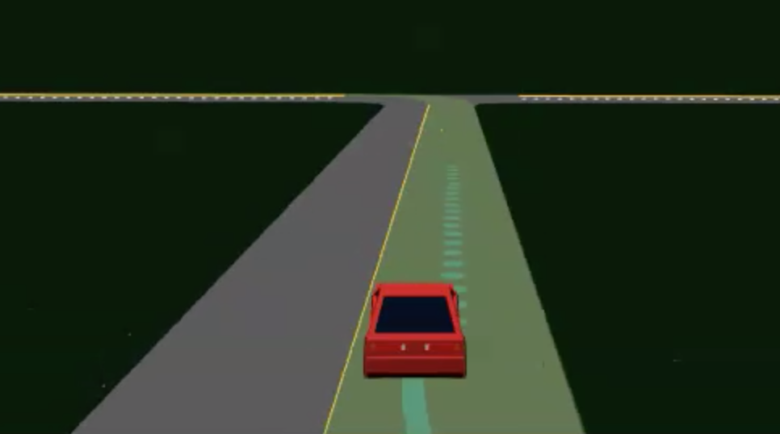
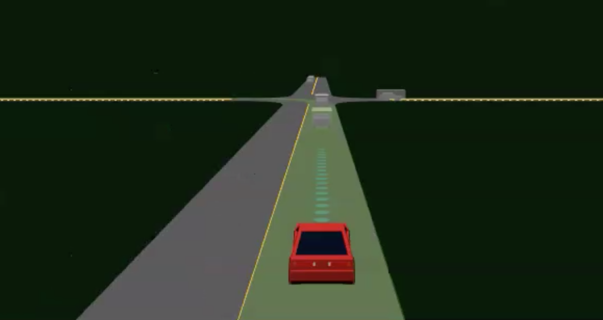

# Getting Started

The following shows how to generate left-turn scenarios for a specific task, then train an agent on those scenarios, and finally evaluate the agent. We will use Task 1 as an example.

## Generating Scenarios for a Task

To begin, start by generating scenarios for a left-turn task. Each task has various left-turn scenarios that aim to teach the agent something. Task 1 trains the agent to generalize its knowledge on the type of intersection. This is done by creating left-turn scenarios in t-intersections for training, and left-turn scenarios in cross-intersections for testing. All supported tasks are listed under `ultra/scenarios/`.

Task 1 Training Scenario|Task 1 Testing Scenario
:----------------------:|:---------------------:
 | 

- If you have not yet generated the maps used by the ULTRA scenarios (available in `ultra/scenarios/pool/`), run the following command:
  ```sh
  $ scl scenario build-all ultra/scenarios/pool/experiment_pool/
  ```
  > Maps are descriptions of the roads used in the scenarios and only need to be compiled once. They only need to be compiled again if they have been modified.
- Now we can generate the scenarios for Task 1. Each task has a `config.yaml` file describing the levels of the task:
  ```yaml
  ego_mission:
  ...  # The start and end points of the agent's route.
  level:
    ...
    <level_name>:
      train:
        total:  # The number of training scenarios to generate.
        intersection_types:
          <intersection_shape>:
              percent:  # Proportion of scenarios with this intersection.
              specs:  # Speed, density, and proportion of the traffic.
      test:
        ...
    ...
  ```
  Notice in `ultra/scenarios/task1/config.yaml` the levels of Task 1 include "hijack", "no-traffic", "easy", and "hard". Each level has "train" and "test" scenarios defined by the "total" number of scenarios produced and the intersection types. For example, Task 1's "easy" level produces 10000 training scenarios containing all t-intersections, and 200 testing scenarios containing all c-intersections. Modify these numbers to be 10 and 2 respectively,  and then generate the "easy" level scenarios of Task 1:
  ```sh
  $ python ultra/scenarios/interface.py generate --task 1 --level easy
  ```
  > There should now be 12 (= 10 + 2) scenario folders under `ultra/scenarios/task1/`.
- (Optional) Now that we are ready to train and evaluate, we can start Envision to visualize the process. To do this, run the following command:
  ```sh
  $ ./ultra/env/envision_base.sh
  ```
  > Envision runs as a background process, you can view the visualization on `localhost:8081/`.

## Training a Baseline Agent

Implementations of baseline agents are available in `ultra/baselines/`. Notice, policies such as PPO, SAC, TD3, and DQN are implemented as baselines. We will run a DQN on Task 1's "easy" level in this example.

- Execute `ultra/train.py`. The following is a list of available arguments.
  - `--task`: The task number to run (default is 1).
  - `--level`: The level of the task (default is easy).
  - `--episodes`: The number of training episodes to run (default is 1000000).
  - `--max-episode-steps`: The option to limit the number of steps per epsiodes (default is 200).
  - `--timestep`: The environment timestep in seconds (default is 0.1).
  - `--headless`: Provide this flag to run training without Envision.
  - `--eval-episodes`: The number of evaluation episodes (default is 200).
  - `--eval-rate`: The number of training episodes to wait before running the evaluation (default is 200).
  - `--seed`: The environment seed (default is 2).
  - `--policy`: The policy (agent) to train (default is sac).
  - `--log-dir`: The directory to put models, tensorboard data, and training results (default is logs/).

  Run the following command to train our DQN agent with a quick training session (if you started Envision in the previous section, refresh your browser to observe the training):
  ```sh
  $ python ultra/train.py --task 1 --level easy --episodes 10 --eval-episodes 2 --eval-rate 5 --policy dqn
  ```
  > This will train our DQN on 10 episodes and evaluate its performance every 5 episodes by running the agent in 2 evaluation episodes. You will notice that it will switch between training episodes and evaluation episodes.
- During training, a folder `logs/<timestamped_experiment_name>` is produced. It contains:
  - A tensorboard log (`events.out.tfevents.<...>`)
  - Models at different observation episodes (`models/000/<observation_number>/online.pth`, `models/000/<observation_number>/target.pth`)
  - Pickled metadata of your agent (`agent_metadata.pkl`), and
  - Pickled results from training and evaluation (`pkls/Evaluation/resuts.pkl`, `pkls/Evaluation_Training/results.pkl`, and `pkls/Train/results.pkl`).

## Evaluating the Agent

After training your agent, your models should be saved under `logs/<timestamped_experiment_name>` and you can re-run the evaluation.

- Re-run the evaluation with `ultra/evaluation.py`. Available arguments include:
  - `--task`: The task number to run (default is 1).
  - `--level`: The level of the task (default is easy).
  - `--agents`: The ids of agents that you wish to evaluate (default is None; all agents are subject to evaluation).
  - `--episodes`: The number of evaluation episodes (default is 200).
  - `--max-episode-steps`: The option to limit the number of steps per epsiodes (default is 200).
  - `--timestep`: The environment timestep in seconds (default is 0.1).
  - `--headless`: Provide this flag to run evaluation without Envision.
  - `--experiment-dir`: The path to the spec file that includes adapters and policy parameters.
  - `--log-dir`: The log directory location (default is logs/).
  - `--models-to-evaluate`: Provide this flag if you wish to evaluate agent(s) at desired checkpoint(s)

  For example, let's re-run our DQN's evaluation with the following command:
  ```sh
  $ python ultra/evaluate.py --task 1 --level easy --agents <agent_ids> --experiment-dir logs/<timestamed_experiment_name>/ --episodes 5
  ```
  > This will produce another experiment directory under `logs/` containing the results of the evaluation.

  The `--models-to-evaluate` flag will provide you the functionality to evaluate agent(s) at specific checkpoint(s). The `--models-to-evaluate` flag takes a list of arguments in this format: <agent_id>/<model>. For example, if we want to evaluate an agent with id="000" at checkpoints 0, 33, 87, 120 (these values represent the episodes at which the checkpoint was saved) we can run the following command:
  ```sh
  $ python ultra/evaluate.py --task 1 --level easy --agents 000 --experiment-dir logs/<timestamed_experiment_name>/ --episodes 5 --models-to-evaluate 000/0 000/33 000/87 000/120
  ```
  
## View Tensorboard Results

To view the Tensorboard results of this experiment, run the command below:
```sh
$ tensorboard --logdir <abolute_path_to_ULTRA>/logs/<timestamped_experiment_name>
```
> View the result in your browser with the provided link.

## Running Task 2

Now try generating Task 2's scenarios and training an agent on this task by slightly modifying the above instructions (note that Task 2's level names are different than Task 1's level names).
