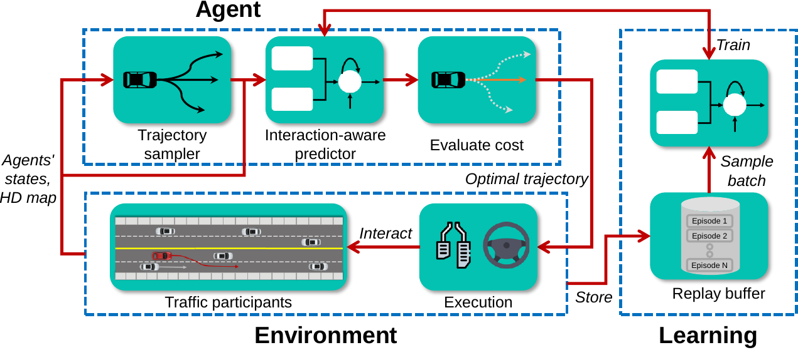
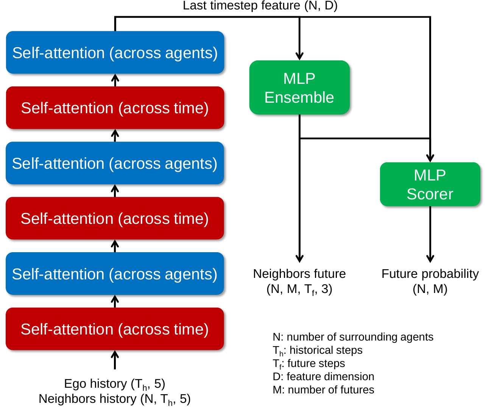
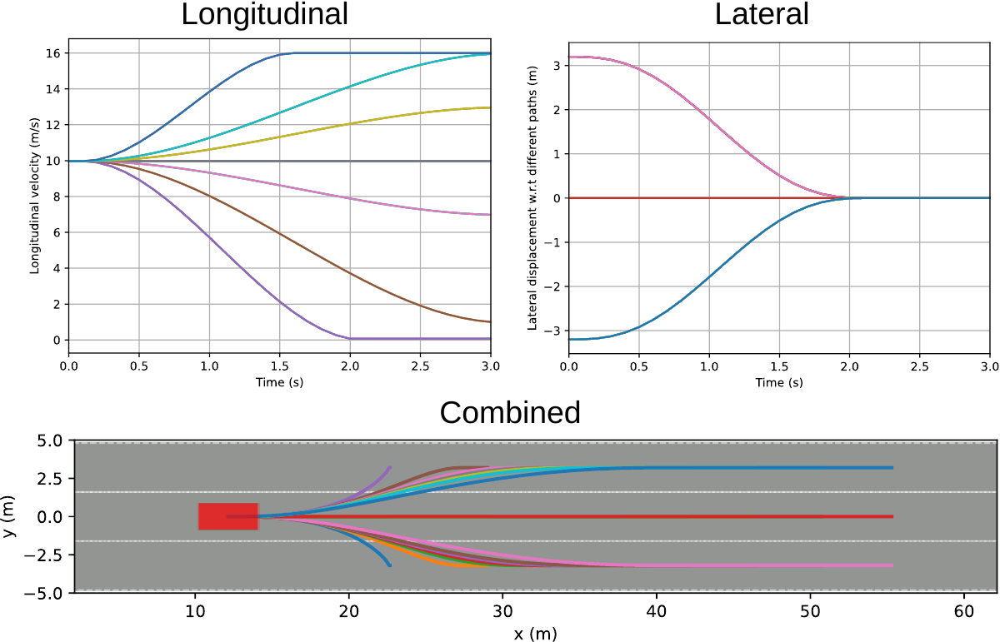

## Source code
This agent was contributed as part of NeurIPS2022 Driving SMARTS competition. The source code by original authors is available at https://github.com/MCZhi/Predictive-Decision/tree/smarts-comp-track1 .

## Technique
We are using a Transformer-based motion predictor to forecast the neighboring agents' future trajectories around the ego vehicle. A sampling-based planner will do collision checking and select the optimal trajectory considering the distance to the goal, ride comfort, and safety. The prediction/planning horizon is 3 seconds and we only execute the first five steps (0.5s) of the planned trajectory. The overall process of our method is given below.

The structure of the predictor is illustrated below. Due to some problems in obtaining the vectorized map for surrounding agents in the competition, we only use the historical observation of other agents (past 1 second) as the input to the predictor. However, it would significantly improve prediction accuracy if we incorporate map information into the network. We consider one ego vehicle and its surrounding 5 vehicles as the network input and predict the future trajectories of the surrounding 5 vehicles. The states of an agent at a timestep consist of its x and y coordinates, heading angle, and velocities along the x and y axes. The network employs factorized attention along the time and agent axes to exploit the dependencies between agents. Then, we take the feature of the last timestep of each surrounding agent and utilize an ensemble of MLP heads to predict multi-modal trajectories and an MLP-based scorer to predict the probability of each trajectory. 

The structure of the planner is illustrated below. First, the planner generates a set of candidate trajectories based on the AV's current state, available routes, and target speed profiles. We decouple the trajectory into longitudinal and lateral directions in the Frenet path and combine them and project it back to cartesian space. Next, the planner obtains the prediction results from the predictor and takes the most-likely trajectory of each agent, and performs collision checking. The planner evaluates all the candidate trajectories using a cost function considering a combination of features including distance to the goal, longitudinal jerk, and lateral acceleration, as well as collision, distance to other agents, and time-to-collision. Finally, the planner outputs the optimal trajectory to the controller. If all the candidate trajectories would cause collisions with other agents, a fall-back trajectory that does emergency braking is outputted instead.

## Training process
An agent equipped with our planner and predictor is set to interact with the environment. We maintain an episodic buffer to store the trajectories of all agents in the environment and dump the data into a replay buffer at the end of each episode. At each training step, we sample a batch of data from the replay buffer from different episodes and timesteps. We can obtain the historical trajectories of the agents and their ground-truth future trajectories at each timestep from the episodic memory. We randomly select a vehicle as the ego vehicle and find its surrounding vehicles to improve the generalization ability of the predictor. The position and heading attributes of the input data are normalized according to the ego vehicle's state at that timestep. The training loss is the sum of trajectory regression loss (smooth L1 loss) on the closest-to-ground truth trajectory and cross-entropy loss of the predicted scores (the closest-to-ground truth mode is the target).

## Related papers
The paper related to this submission is named "Online Learning of Interaction-aware Motion Prediction for Decision-making of Autonomous Driving", which is under review by ICRA 2023.